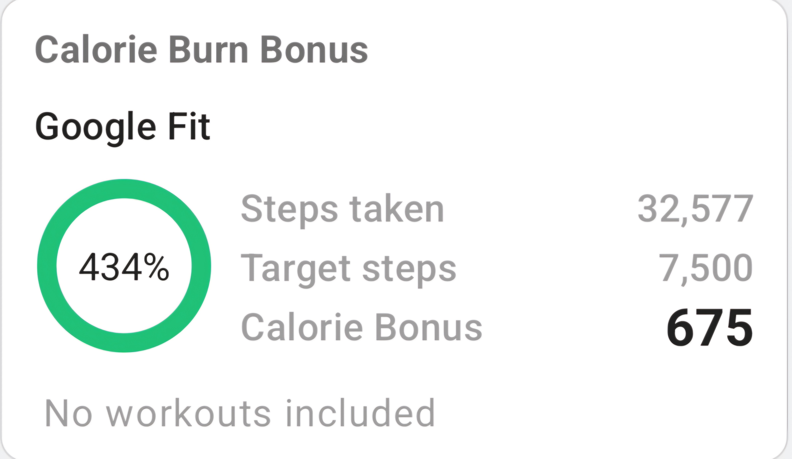

Hey, Welcome to \#1 edition of Joy & Curiosity.

#### What is it?

Inspired from [Joy & Curiosity](https://x.com/thorstenball/status/1639691622928588801) by Thorsten Ball. Each day, I take at least 30 mins or less writing about the things that either stems from curiosity or things that brings me Joy. At the start of the week, i will share it as "Interesting things that happened last week."

#### Why and Who is the Audience

Again Taking it from tweet shared on [this week's Joy & Curiosity](https://substack.com/@thorstenball/p-155084013)

> Tyler Cowen is right: how you write today determines how the AIs will remember you in the future. The AIs read you more often than the humans, and will reflect deeper about what you write. If you care about the legacy of your cognitive aesthetics, become recreatable.

This is mainly for me. But it might change as i write over the weeks. Maybe this will be for bigger audience. There is lot to structure and reason about. But hey if you are reading this. Thanks

## \#1

### Quote of the week

> Chance is an artifact of our ignorance. - Arbuthnot

This is such a convincing answer to the question i had previous week, regarding where all this non-determinism in the world is coming from. But still **ontological randomness** has been hurting me. Randomness as the very nature of things is weird. I have convinced myself with chaos theory which is study of how small changes in initial conditions leads to whole different patterns later on. Perhaps, we can never record all the dynamics of the system at any point which means initial or any conditions can never be fully captured. Measurement has moved itself from the platinum-iridium in Paris to something concrete like using planck's constant is genius. i.e $hv=mc^2$. But still you are just moving the problem. I have yet to look into quantum mechanics and I have little to no knowledge regarding it but randomness as ontology seems to arise from there. Thanks Heisenberg...

- [Be Findable](https://registerspill.thorstenball.com/p/be-findable) by Thorsten Ball has shared some of the work regarding self promotion and he mentions "It's not about screaming "I am the greatest" from the rooftops, it's about saying, hey, I did something, I think it's neat, you might find this interesting."

- read the blog, "[what makes Strong Engineers Strong](https://www.seangoedecke.com/what-makes-strong-engineers-strong/)" . I have mixed feelings about this. The main point is of the blog is, A good engineer has all the following capabilities: Self-belief, Practicality, Tech Abilities and Speed. I believe it isn't as clear as creating a radar chart out of it. All of this comes with experience. Working on a team has another dimension too. All the machineries can't be controlled by a single person. Some key components needs to be abstracted out. I think the best ability of a proper engineer is that to figure out the task by asking "*proper questions*". Everything can be boiled down to problem of input -\> process -\> output. A good engineer knows how to chunk down the task and can recognize the gap in their understanding. Overall i would recommend people to read this blog.

- Reading through the Book "[Ten Great ideas about Chance](https://press.princeton.edu/books/hardcover/9780691174167/ten-great-ideas-about-chance)". The first chapter is insightful. Here is the brief outline of the chapter "*Measurement*"

  It has to do with chance. First we identify the **equally probable** cases, like the dice roll, picking from the deck of cards etc. And the fundamental notation $P(A)$ which means
  $$
      P(Win)  = \frac{Number\ of\ cases\ where\ you\ win}{Total\ number\ of\ cases}
      $$
  The fundamental law of probability is $P(Win) + P(Loss) = 1$. This is so simple yet so powerful. Consider the question, "What are the chances that you share the birthday with your friends in the classroom. Given that there are 50 students, the probability is over $97\%$".
  So the idea $P(Two\ people\ same\ birthday) + P(Pairs\ with\ different\ birthday) = 1$.
  Figuring out different birthday is easy... Suppose there were only two person in the room with different birthday then $\frac{364}{365}$ days are available to 2nd person for his birthday. For 3rd person $\frac{363}{365}$ days are available, for 4th person $\frac{362}{365}$ and so on... For $50^{th}$ person it's $\frac{365-50+1}{365}$ days available to him. These all have to happen simultaneously. It's not a question of A OR B but its about A AND B AND C till 50th person.
  $$
       P(Pairs\ with\ different\ birthday) = \frac{364}{365}.\frac{363}{365}.\frac{362}{365}.\frac{361}{365}...\frac{365-N+1}{365}\approx3\%
       $$
  So $P(two\ people\ with\ same\ birthday) = 1 - 3\% = 97\%$

  All this has to do with equiprobability. Given that people can have birthday at any day of the year, this holds true but consider here in Nepal where marriage take place in winter season so the chance of having birthday on winter is higher as consummation happens at that period.

  Another cool fact, "Dice players consider 10 and 11 to be more advantageous than 9 and 12 when throwing three dices". Galileo said ,To make 9 if all the three die have turned out to be "3" face, it's a single possibility of \<3,3,3\>. But if you consider 10, then there are three possibility even for 4,3,3. i.e
  $$<4,3,3>\ <3,4,3>\ <3,3,4>$$

  Fermat and Pascal also discussed in length about *Problem of Dice*, where a person bets $S$ stake to roll $6^{th}$ face within 8 tries. But the twist is ,the person is asked to forego the 4th throw. He has to be compensated some amount for that leaving that 4th throw. What amount within the stake has to be compensated so it's fair. Here they bring in the concept of **expectation**. The main idea was blatantly obscure for me. The probability of winning on each round is always $\frac{1}{6}.s$ , because if the person reached the 4th round it means the previous throws were useless and don't affect his new throw. But for losing, it is different . For the last round it's $\frac{5}{6}.s$ , for the penultimate round, it should be ${\frac{5}{6}}^2.s$ , as there are 11($6^2- 5^2$) scenarios where you might win. The first 5 of them are obvious. The person got rolled wrong face in the 2nd last round, there are 5 such cases. Suppose 3 was the required face then it's

| 5th round | 6th round |
|-----------|-----------|
| 1         | 3         |
| 2         | 3         |
| 3         | 3         |
| 4         | 3         |
| 5         | 3         |

If we win on 5th round with 3 then there are 6 cases on 6th round we don't have to account for. Think for a second, we already won on 5th round why do we have to care about 6th round

| 5th round | 6th round  |
|-----------|------------|
| 3         | Don't care |
| 3         | Don't care |
| 3         | Don't care |
| 3         | Don't care |
| 3         | Don't care |
| 3         | Don't care |

So if we just extend this idea till 4th last round then we have $6^4 - 5^4$ outcomes where we win, which gives us $\frac{6^4-5^4}{6^4}$ probability of us winning. we can just write it as $P(win\ at\ one\ of\ the\ rounds\ within\ remaining\ 4\ rounds)=1 - \frac{5^4}{6^4}$

But we want to lose at the 4th round. The probability of losing on any round is just $5/6$ and is same for 4th round too so you get $$\frac{5}{6}.(1 - \frac{5^4}{6^4}).Stakes$$
This is the stakes now available to him. But the answer to our question is hilarious. He just gets $1/6^{th}$ of the stakes no matter at which point he discards his turn. The questions remaining are
what if the person is asked to discard two rounds randomly. It's not $2/6$ of stakes because if he discards 6 rounds and if there were 100 rounds, he would get whole stake for discarding just 6 rounds.

- Ever thought how synchronization primitives such as Mutex restrict only one lock exists at a time. I think [RAII with Guards](https://rust-unofficial.github.io/patterns/patterns/behavioural/RAII.html) is excellent place to start.
  Lets define our mutex first

``` rust
use std::sync::atomic::AtomicBool;
use std::cell::UnsafeCell;


struct AwesomeMutex<T> {
    locked: AtomicBool, 
    data: UnsafeCell<T>
}

unsafe impl<T> Sync for AwesomeMutex<T> where T: Send {} 

impl<T> AwesomeMutex<T> {
    pub fn new(data: T) -> Self{
        Self {
            locked: AtomicBool::new(false),
            data: UnsafeCell::new(data)
        }
    }

    pub fn lock(&self) {
        // TODO: Here
    }
}
```

Just to catch up, `UnsafeCell` is low level primitive in rust that allows interior mutability. It provides raw, mutable pointer to inner value, when accessed through immutable reference. The rules of rust don't apply to raw pointers and `get()` method provides us the raw pointer which we can do anything with.

`AtomicBool` is thread safe way to work with bool value. Rust follows c++20 atomic standard re. Idk what c++ atomic rules are, but if i were to stick to the basics i can infer that there are thread which are units of code that can work individually. The problem lies in sharing data.
I think specifically where you communicate by sharing memory. Reads and writes are coming from all threads. You need to have some `ordering` on how you want to work with those read writes. You can enforce constraint that this operation needs to happen first before all the operations in pipeline, which is what `acquiring` means. It's like you need to show license before you can drive a car. Police officer needs to `read` the license. You can enforce a constraint such that all the operations on the pipeline/queue needs to take effect before this operation happens, which is what `release` means. Before releasing someone from prison, all the necessary checks should happen, so that you can `write` another life??
At the end all these fancy atomic operations utilize LLVM intrinsics like `llmv.atomicrmw` which gets converted to architecture specific lock opcodes like `AMOSWAP` in risc-v.

Now back to guards. Let's add em

``` rust
use std::sync::atomic::{AtomicBool, Ordering};
use std::cell::UnsafeCell;


struct AwesomeMutex<T> {
    locked: AtomicBool, 
    data: UnsafeCell<T>
}

unsafe impl<T> Sync for AwesomeMutex<T> where T: Send {} 

impl<T> AwesomeMutex<T> {
    pub fn new(data: T) -> Self{
        Self {
            locked: AtomicBool::new(false),
            data: UnsafeCell::new(data)
        }
    }

    pub fn lock(&self) -> MutexGuard<T>{
        // check if lock is availble
        // expected, new, if we found expected value, if non expected value is found
        while self.locked.compare_exchange(false, true, Ordering::Acquire, Ordering::Relaxed).is_err() {}
        MutexGuard { inner : self }
    }

    pub fn data(&self) -> &T {
        unsafe { &*self.data.get() } 
    }
}

struct MutexGuard<'a, T> {
    inner: &'a AwesomeMutex<T>
}

impl<T> std::ops::Deref for MutexGuard<'_, T> {
    type Target = T;

    fn deref(&self) -> &Self::Target {
        unsafe { &*self.inner.data.get() }
    }

}

impl<T> std::ops::DerefMut for MutexGuard<'_, T> {
    fn deref_mut(&mut self) -> &mut Self::Target {
        unsafe { &mut *self.inner.data.get() }
    }
}

impl<T> Drop for MutexGuard<'_, T> {
    fn drop(&mut self) {
        self.inner.locked.store(false, Ordering::Release);
    }
}

fn main() {
    let my_mutex = AwesomeMutex::new(10);
    {
        let mut guard = my_mutex.lock();
        *guard = 20;
    }


    println!("{}", my_mutex.data());

}
```

- There is another cool idea on book "Ten Great Ideas about chance" about "Problem of points". Suppose there are two people with equal skills and they start playing game which concludes in 6 points. Lets suppose the game is **COIN FLIPS**. For each round won, winner gets 1 point. First player has won 5 points and second player has won 3 points. Now, for some reason they can't complete the game, how would you divide the share of their stake fairly?
  The key idea came from Fermat again, who figured out that if player 1 needs $r$ points to win and player 2 needs $s$ points to win then the game will be completed in $r+s-1$ rounds. So for our question, first player requires 1 point and second player require 3 more points to win, so game will be completed in $3+1-1$ points. Player two will have to win 3 out of 3 rounds. so the odds are $\frac{1}{8}$ and for player 1 the odds are $\frac{7}{8}$. So the share should be divided accordingly.
  "The question to reader is. Coin toss game, Ten rounds and Six points win... one has no points and the other has 1 point. How do you divide the share fairly?"

- Huygen's gave the real brainf\*ck anyways. Suppose a scenario where two person play a game where one person has three coins on one hand and seven coins on another. One is asked to pick between one of the two hands. This is same thing as if that person has five coins on one hand and five on another. There is no difference when played over and over. This is key concept of **expectation**. When you think about it, it makes sense when you understand variance. 3 and 7 is far from the mean ((3+7)/2) = 5, but the Risk associated is same as gaining or losing 5 coins.

- `Account abstraction (ERC-4337)` is mentioned in [Vitalik's personal user experience](https://vitalik.eth.limo/general/2023/02/28/ux.html.). Account abstraction is what i have been working most time this week. Yes you do need EOA or another equivalent account to sign the User operation. But I think moving towards that makes UX more accessible. Stuff like account recovery doesn't require guardians(bunch of people you select to recover ur acc) to download new app just for sake of being your guardian.

- Went up hiking to **champadevi**. Last week i went to **Jamacho** and it was around $\approx 8kms$. Champadevi was nearly about twice as long but i am proud of walking around $\approx16 km$ .
  
