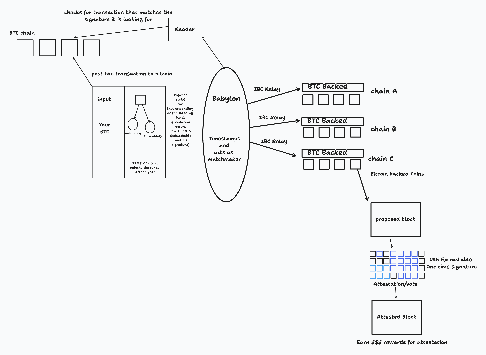

- [Parse, don't validate](https://lexi-lambda.github.io/blog/2019/11/05/parse-don-t-validate/) is interesting read. "Parsing is conversion of unstructured data to slightly structured data" . If every computation follows `input -> process ->  Output` model, then parsing is quintessential. Complex systems are not completely linear when you reason the expected initial behavior.,But we can always break it down to reasonable chunks. The state change between various chunks might require its state input to be in exact format where validation kicks in. Often time we don't think in state change and it leads to just the validation and processing. This is where "**[shotgun parsing (watch the video)](https://www.youtube.com/watch?v=3kEfedtQVOY)**"kicks in. Shotgun parser checks for input validity though out the code and it mixed with processing logic. These validation checks are nothing meaningful and doesn't contribute to state change chunks. For example, if we are required that the dynamic array should always be non empty, then we setup a validator function

``` rust
fn validate_vec_non_empty(data: Vec<u32>) -> Result<(), String> {
   if data.is_empty() {
      return Err("Data is empty".to_string());
   }
   Ok(())
}
```

As i said earlier, the validator just has a single purpose of checking if input is empty or not. It doesn't concern itself with where this code is to be injected. What if the programmer wrote this but forgot to plug in the logic? What if the placement of this validator is in wrong place? The wrong state is likely.

Instead the author is pointing towards a [state machine](https://talesfrom.dev/blog/fsm-functional-state-machines) thinking, where each function is required to contribute something to state. The data that is being fed should do something meaningful. For example in our above example, why are we validating/checking if the vector is empty or not in the first place. There must be some good reason behind this. Perhaps, we are designing a CLI application where first argument is mandatory. This means there is a actual requirement for you to take the first element. So why don't we just modify the function to give us the first element while also ensuring program fails if first element is not preset.

``` rust
fn parse_vec_non_empty(data: Vec<u32>) -> Result<u32, String> {
    data.first().ok_or("Data is empty".to_string()).copied()
}
```

We can also create data structure such that the illegal state is completely unrepresentable. What if we defined our structure as

``` rust
struct NonEmtpyArgs {
    first: string,
    other: Vec<string>
}
```

The datatype is now informing the code where you can't even create a `NonEmptyArgs` if the vector you are provided initially is empty. You enforce the validation to the structure. Last thing that i really liked is "Always have a single source of truth. For multiple copies of same data if it differs will lead to illegal state."

Literally 10/10 blog

- Read the paper [Unlocking 21M bitcoins to Secure the Proof-of-stake](https://docs.babylonlabs.io/papers/btc_staking_litepaper(EN).pdf) . This is absolutely fantastic. The premise of the paper is that "All the bitcoins are idle in the chain. They aren't generating rewards for the bitcoin owner. This isn't the case for Ethereum where you can stake your 32 ETH to become a validator. For every attestation(signing that this block is valid) or randomly you being selected as a block producer for particular slot gives you the reward. Also if you are naughty then you are slashed".
  Babylon is bringing the exact concept right in bitcoin. It is not dependent on some Multisig of bunch of operators. You just define a transaction that is time locked for particular period of time, meaning you get to take those funds after X time has passed. The other output will be **slashing transaction** that will immediately burn 1/3rd of the funds given that you are found to be violating the security model of the system( signing two blocks in a single slot and other [complex conditions](https://github.com/ethereum/casper/blob/master/VALIDATOR_GUIDE.md)). So once you create this transaction understood by the bitcoin reader of babylon chain. It can now match you up with various Proof Of Stake chains as shown in the figure.

<figure>

<figcaption aria-hidden="true">Babylon.png</figcaption>
</figure>

I will further investigate on this and read their docs and come up with better explanation in next joy and curiosity
- Read the two chapters of ["Why Nations Fails".](https://en.wikipedia.org/wiki/Why_Nations_Fail) the TL;DR is "The economic and political institutions are the reason why some nations do better than others. If the country is setup to concentrate power and wealth among select few, then it leads to stagnation, tremendous wealth gap and inequality."The book seems to be answer to why is it that these powerful, wealthy nations found themselves in current condition of prosperity, immense wealth whereas the countries like Nepal, Congo, Haiti etc has been unfortunate. Two powerful example seemed to stick to me.
- Carlos slim is billionaire of Mexico and Bill gates is billionaire of USA. What's the difference between them? The problems in Mexico such as entry barriers in political connections and politics, voracious corruption, inept/clumsy constitutional mechanism protecting the rich allows person like Carlos slim to have significant more power than Bill gates. The `Amparo` constitution mechanism protects Carlos slim and helps them keep their monopolies. For instance, in 2013, the Mexican government enacted reforms to increase competition in the telecommunications sector, which directly impacted Slim's companies. In response, Slim's lawyers filed `amparo` lawsuits to contest these regulatory changes, aiming to protect their business interests.
Bill gates can come under scrutiny easily in US. No matter how much money the guy has, he has to stand before congress if people deem so, allow multiple web browser to exist in his operating system even if his incentive is always to maximize profit.
Carlos tried his tactics in USA and conned his US partner to setting up his own chains but his partner firm filed for lawsuit and won \$474 million for breaching the contract. Have it been in Mexico, Carlos would have likely bought the lawyer commencing against him and make all the people to his site.

    * Nogales, a city split by the U.S.-Mexico border, highlights the contrast between inclusive and extractive institutions. Nogales, Arizona (USA) enjoys a stable democracy, strong rule of law, and an economy that provides higher wages, better infrastructure, and quality public services. In contrast, Nogales, Sonora (Mexico) struggles with weaker governance, corruption, lower wages, and higher crime rates, partly due to cartel influence. Despite sharing the same geography, culture, and history, their economic outcomes differ due to the institutions governing them. While Arizona’s legal and economic systems encourage investment and innovation, Sonora’s extractive institutions hinder long-term growth, reinforcing Why Nations Fail’s argument that prosperity is shaped by political and economic structures, not just geography

- Sometimes i do ask myself. "Am i capable of loving someone? Or am i worthy of all the love that i get?". Belove Dai had the same dilemma, so i know this is not something unique to my personality. But it has been too long since i have acted due to fear of rejection. I constantly have to remind myself, Rejection is not attack on my self worth. It's the misalignment in the goals, mindset and trajectories of people. But not this time, I will face it like a champ. I will be real to myself. But what does that even mean?  
- There is this awesome channel called [Nerdforge](https://www.youtube.com/@Nerdforge) ran by couple Martina and Hansi. They are arts and crafts channel. TIL that Hansi was a software engineer before youtube lucked out for them. Well I aspire to have similar arrangements in future. The question remains , where do i search Martina for my channel?
- Mom's 50th birthday was the best it could have been. Each moment felt good. Thanks for being my source of motivation and my very ability to cut through haze of adulthood to keep marching forward.

<video src="Joy%20%26%20Curiosity%20%233-media/output.mp4" width="200" type="video/mp4" controls></video>

- Finally got my passport and i am now ready for my month long visit to Turkey form March 16-April 17. But i felt really weird giving all my biometric information. Getting the citizenship wasn't this terse. But seems like getting passport is different beast. I have to provide all the unique signature my body has.  
- Made Panipuri and brownies in the weekend with my Sisters and Brothers. It was fun..... Seems like i should capture the moments and not the results, because they seem meaningless. Even though i am proud of the teamwork.

-----------------

#### Photodump of the week

| <br> | <br> |
|----|----|
|<br> |<br>|


