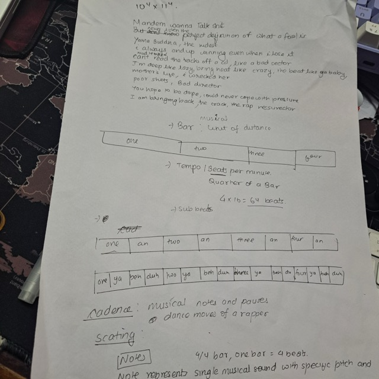

Modern dictionaries have lost their vividness, unlike Webster's 1913, which embraces the richness of language. Growth happens in cycles, and even Newton needed normal conditions to refine his discoveries, reminding us that dormancy isn't failure. Also little bit on structure of rap music to Rust's out-of-thin-air values, fuzz testing, and AI-driven development tools. It's my week worth of Joy & Curiosity

Inspired by Joy & Curiosity by Thorsten Ball, I spend about 30 minutes daily exploring curious and joyful topics, shared weekly as "Interesting things that happened last week."

### You are using the Wrong Dictionary

> English is awfully subtle instrument.

[You are using the wrong dictionary](https://jsomers.net/blog/dictionary): 26 years, 28 languages and Noah Webster came up with this masterpiece of a dictionary with 70k words. It's different from engineered modern dictionaries like Oxford and Google search. Modern dictionaries are desiccated little husks of technocratic meaningese, as if words were not more than its coordinates in semantic space. A full team is made to construct generic axiomatic words that strip away the color, the vividness all in name of making it succinct. But the creation worth remembering blooms from labor. Your favorite stories, and poems gives you a sense that there was another mind as alive as you are who labored while sitting at his desk, tussling with own mind to churn out the froth which was lacking in previous iterations. Noah's dictionary has that very essence. Dictionary is not a utility and it shouldn't be. The words are delightful. Webster's 1913 version embraces that very fact and removes the **The clamour(noise) of pedantry(concern with minor details)**

Here is one example for the word *glisten*

Webster 1913:
[Glisten](https://www.websters1913.com/words/Ethos): To `glisten` is to shine with a soft and fitful luster, as eyes suffused with tears, or flowers wet with dew.

Google Dictionary:
(of something wet or [greasy](https://www.google.com/search?sca_esv=056ac76124f4447b&q=greasy&si=APYL9btfm7lNLuo1yW1KZRdWc6yLPGHkd47bU0efMI7WBeJqwzY0gE46O-B1ZelGfrTZCOH81ATA1dEPiZO4WHPcsaGyxI--AA%3D%3D&expnd=1&sa=X&ved=2ahUKEwium_bCxuSLAxX3nK8BHXh0M5YQyecJegQIQRAP)) shine with a sparkling light.

The first example evokes vividness. It provides the analogy to associate glistening with. Wdyt?

### I'm not languishing, I'm dormant

> It is a mistake and a misreading of nature to think that you, a living creature, will be flourishing all the days of your life.

Mental Health is on a spectrum that goes from depression to flourishing.... There is a **void** between it and it's called languishing. Not totally burnt out, but also not in full steam, either. Languishing happens when one tries to flourish in terrible conditions like a farmer trying to plant seeds on snow. There are many such analogous external factors that can't be controlled. But *almanac* points out the preparedness one can do for the upcoming spring. It's the idea that things run in cycles.

[Austin Kleon](https://austinkleon.com/2021/04/26/im-not-languishing-im-dormant/) in his blog post shared a piece of history worth sharing related to Isaac Newton and quarantine that fits together growth within languishing period

> The true fact (historian here, this is my period!) is that Newton did theorize gravity while quarantining, but didn't have library access, and while he was testing the theory he didn't have some of the constants he needed (sizes, masses), so he tried to work from memory, got one wrong, did all the math, and concluded that he was wrong and the gravity + ellipses thing didn't work. He stuck it in a drawer. It was only years later when a friend asked him about Kepler's ellipses that he pulled the old notes back out of the drawer to show the friend, and the friend spotted the error, they redid the math, and then developed the theory of gravity. Together, with *full library access*, when things were normal after the pandemic. During the pandemic nobody could work properly, including him. So if anyone pushes the claim that we should all be writing brilliant books during this *internationally recognized global health epidemic*, just tell them Newton too might have developed gravity years earlier if not for his pandemic.

#### cool tweet of the week

\`

### The element of Rap Music

All of a sudden i remembered [KTM Grime](https://www.youtube.com/watch?v=7ENDMTFO7Qc) by Yama Buddha. I wrote some of the lyrics and tried rapping on the beat. One thing lead to another and then i was looking at the difference between `bar` and a `note`.

<figure>

<figcaption aria-hidden="true">20250228_010825Medium.jpeg</figcaption>
</figure>

Here is my current understanding
- **Bar**: Musical unit of distance. It's a container for beats. It's like a `Kilometers` marker on the road. You can say 16 bar common beats and it would have `16 * 4` = 64 beats.
- **Beat**: It is fundamental pulse of a song.
- **Tempo**: It's beats per minute. The speed of the beat. If the song is 60 BPM then each beat will last 1 second and each bar will last 4 seconds for 4/4 time. 4/4 time means a bar is divided into 4 beats.
- **Notes**: It is duration within a beat. It controls the pace within each bar. So if you are playing a piano and something has to be played whole note then for the entire bar one will hold the piano key. There is also half note, quarter note, eighth note , sixteenth note.

What makes a good rap music good?
- *Cadence*: Musical notes and pauses.
- *Scating*: nonsense syllables. Skiddy bop bop
- *Delivery*: The voice tones, the emphasis
- *Good Lyrics*

## Out of Thin Air Values

While reading the book `Rust Atomics and Locks`. There was this weird concept called Out of Thin Air values. This is related to Memory Ordering. It gives us various guarantees about the order in which operations will be performed and seen. This is necessary when we share data between two simultaneously running piece of code. They might read and write at same time when we never wanted the data to be read and write in the first place. To avoid such situation we have various ordering models . *`Relaxed` is one of the simplest memory model whose job is to guarantee that the order seen by one thread should be no different than the other thread. It doesn't guarantee anything else than that.*  
This is example of a two thread scenario, where we are looking to swap the values in `AtomicUsize`. The values are initialized as `0`. After swap the values should still be `0` . But turns out there is a hypothetical scenario that it might be `37` or `42` or any random value in a relaxed memory model

``` rust
use std::sync::atomic::{AtomicUsize, Ordering};
use std::thread;

static X: AtomicUsize = AtomicUsize::new(0);
static Y: AtomicUsize = AtomicUsize::new(0);

fn main() {
    let handle1 = thread::spawn(|| {
        let x = X.load(Ordering::Relaxed);
        if x == 42 {
            Y.store(1, Ordering::Relaxed);
        }
    });

    let handle2 = thread::spawn(|| {
        let y = Y.load(Ordering::Relaxed);
        if y == 1 {
            X.store(42, Ordering::Relaxed);
        }
    });

    handle1.join().unwrap();
    handle2.join().unwrap();

    // Possible out-of-thin-air scenario: X could be 42 without any explicit store of 42.
    println!("X: {}, Y: {}", X.load(Ordering::Relaxed), Y.load(Ordering::Relaxed));
}
```

The most convincing answer to how out of thin air values can come is given on [Rust Atomics and Locks Chapter 3 example clarification](https://users.rust-lang.org/t/rust-atomics-and-locks-chapter-3-example-clarification/93956/4) by `🐐hax10` and i am just paraphrasing it

Take the following pseudocode

``` rust
x = 0, y = 0

Thread 1:
    local = x
    y = local

Thread 2:
    local = y
    x = local
```

We would intuitively expect both x and y to end up as 0, and regardless of the order in which the threads are executed, any reads from these variables at any point would always return 0.

However, as pointed out above, if we use relaxed memory ordering, the C++/Rust memory model previously allowed the machine to invent numbers out of thin air, i.e. it could compile down to something like this:

``` rust
x = 0, y = 0  
Thread 1:
    local = x     
    y = local  
Thread 2:     
    local = 37     
    x = local     
    local = y     
    if local != 37:         
        x = local
```

Now this raises a few questions:

1.  Why would the compiler do something like this?

2.  Why is it allowed?

3.  Does it cause problems in theory?

4.  The compiler at compile-time or the hardware at run-time is allowed to speculatively return a value for y if it has some reason to believe that a particular value is likely, e.g. based on analysis of past return values. Therefore, this is a type of optimization to potentially speed up the code's run-time performance.

5.  This optimization used to be allowed because it didn't violate the theoretical model of relaxed memory ordering, which only requires that all threads see the same order of changes to x and y. The "optimized" code doesn't break the rules since both threads either see 37 or 0.

6.  Therefore, we have a "bug" in the theory, because this simple definition of relaxed memory ordering permits us to produce an obviously wrong result, but we also don't want to throw away the nice, simple definition because it's still useful in many ways. There hasn't been any agreement on a replacement definition.

### Misc

- Looked into `(cargo-fuzz) libFuzzer` and `rust-fuzz (AFL-Fuzz)`. The entire process of **mutation-based testing**---injecting **instrumentation**, flipping bits, modifying bytes, and watching as the fuzzer uncovers unique failures---feels almost like **black magic**. It's fascinating how randomness, guided by coverage feedback, can systematically **break software** and expose hidden bugs lurking beneath the surface.

- [QubesOS](https://www.qubes-os.org/intro/) is security oriented operating system for single user desktop computing. It is based on [Xen](https://wiki.xenproject.org/wiki/Xen_Project_Software_Overview) which is bare metal hypervisor. I thought it's similar to [ProxMox](https://www.proxmox.com/en/) but one is a distro and another is just a microkernel that only does essential tasks for virtualization. In QubesOS each app runs in isolated VM and is based on strong compartmentalization. It's the epitome of High security personal computer. Also look into IOMMU and VFIO

- Tried out [Trae](https://www.trae.ai/) code editor. Started questioning what value it's really providing. It's yet another VSCode fork. But still i can't overlook the fact that these features really make life easier that is the reason why cursor is [2.6 billion dollars](https://techcrunch.com/2024/12/19/in-just-4-months-ai-coding-assistant-cursor-raised-another-100m-at-a-2-5b-valuation-led-by-thrive-sources-say/) in valuation . So installed [avante.nvim](https://github.com/yetone/avante.nvim). Turns out Gemini API is free right now..... so i can ask quick question without leaving Neovim. The efficacy is not as quite as sonnet 3.7 but serious questions requires some serious documentation exploration too. But i was thinking something along the line of [.cursorrules](https://ghuntley.com/stdlib/) would greatly benefit any project

- Convert any git repository to simple text digest to feed to llm with [Gitingest](https://gitingest.com/voidash/8085-Emulator).

- [Exo](https://github.com/exo-explore/exo) can run AI cluster at home with everyday devices.

### Words of the week

- Banal : predicatable

- Brevity : consiceness

- clamour : noise

- pedantry : concern with minor details

- evananscent: soon to be forgotten, flash

- 
