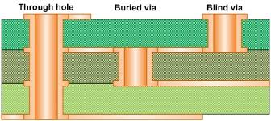

- [Hanlon's razer](https://en.wikipedia.org/wiki/Philosophical_razor) says, "**Don't attribute to malice, which can be explained by Stupidity**". A junior programmer introducing RCE to codebase might be oblivious to it. A politician might genuinely be working for the interest of people, but may not know the nuances of potentially pernicious policies they are lobbying for. Michael Saylor gives a little bit of history regarding Washington's death. . George was subjected to multiple rounds bloodletting. The physicians were not ill intentioned, but had a flawed understanding about human body. Back then, Bloodletting was common practice believed to cure various illness. But It lead to death of Washington. Ergo *Incompetence is not malevolence*

- Was going through instagram reels, and suddenly came across the reel with following inscribed
  \> **I wanted to be born as a star, but someone had a different idea**
  \> That's how I ended up as a street lamp. I die too soon and flicker too much. But yesterday I saw a moth try to kiss me. It almost burned her.
  \> *I have heard stars don't get this luxury*

- The beauty of cli autocomplete.... It gave me the exact command i was looking for. I wanted to share this specific snippet, because i suddenly got ambushed by all arduous labor that went to painstakingly figuring it out. A sudden headache and a moment of relief because LLMs have got much better if you can chunk out your problem statement.

``` bash
# loop
for i in $(seq 1 10)
do
  echo "start $i"
  # expect 
  expect -c "
      set timeout -1
      spawn strata faucet 
      expect \"Enter your password:\"
      send \"\r\"
      expect
  "
done  
```

BTW *`Expect`* command is for automating interactive applications, that require manual input. First you need to start it's interpreter. It has commands like `spawn` , `send`, `expect`

### On clean code

One of my senior wrote down the following on a LinkedIn post.

> Most developers waste too much time trying to write "perfect" code.  
> Users don't care about "clean" code, they care if the app is slow, UI is broken or a feature is missing  
> Clean code is useless if the product fails 🤷.  
> If you spend hours debating semicolon usage while your competitor ships features, you're losing.  
> Do you optimize for code quality or shipping speed?

There are bunch of questions that would make understanding the perspective better.
- What kind of software is being talked about?  
- What is the organizational model of the code being talked about?
- What phase of development cycle benefits from such argument?
- where does this chain of thought come from?  
- what does clean code encompass?

For me it's the appropriate docstring, proper variable naming, well thought out functions and their behavior, with tests case covering alot of scenarios. I don't believe in scaling existing code. It's the refactoring that does that and one shouldn't assume any part of the code as holy and untouchable, especially it's the code you wrote.

And i don't enforce this everywhere. I do treat prototype as a crude mix of ideas. But i also note the room for optimization as i go on. The patterns i recently have started recognizing is that  
If your product tries to be generic then it will fail. Trying to do all things all at once makes a mess. The quality of code has nothing to do with this. I believe in both sweeping and incremental refactors, that will sort things out.

- I Sat in Pashupati for some period of time
- write about Design


- [Digikey intro to keycad](https://www.youtube.com/watch?v=vaCVh2SAZY4)
