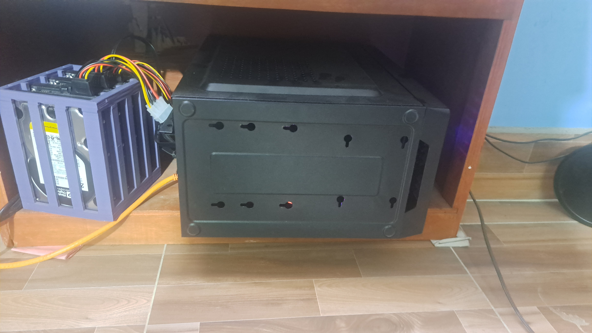
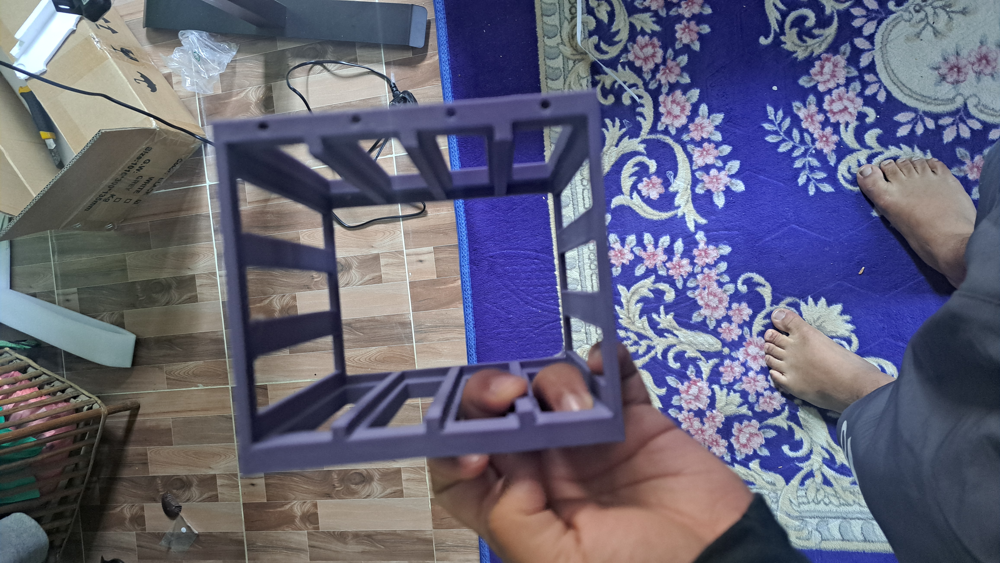
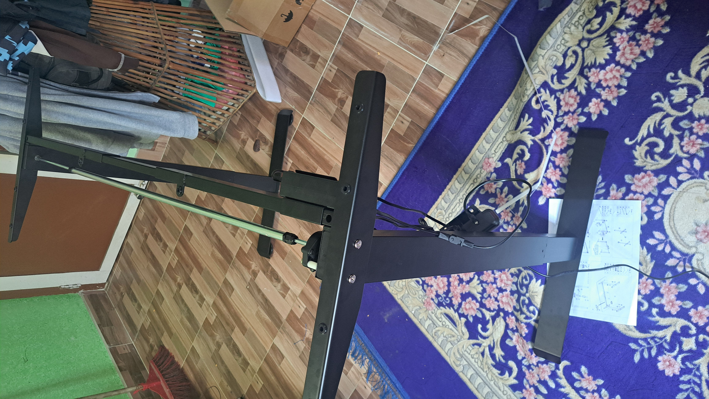
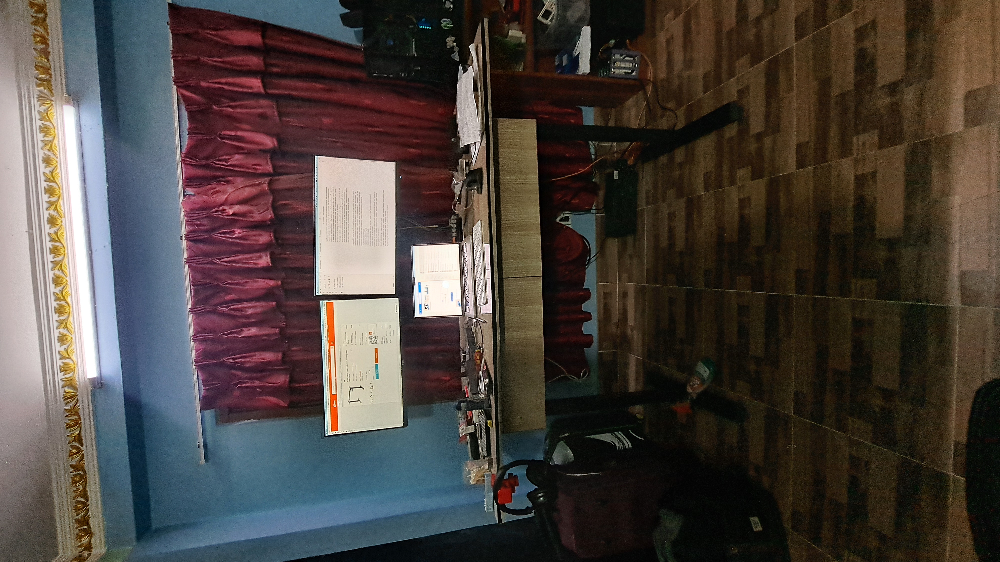

- "There are no shortcuts in ~~programming~~ problem solving". Looking at the post [The Best Programmers I know](https://endler.dev/2025/best-programmers/), I am reminded of my worst mental model when it comes to programming problems. I believe that "If the task is simple enough then it is not necessary to touch the fundamentals of the tool i am using for finding solution, hoping somebody else has already encountered it and there will be solutions around the internet", This surprisingly works for lots of tasks but there are cases where
  - I misjudge the problem and it turns out to be gory mess which requires significantly more effort

  - The problem is big one which requires dividing into into smaller sub-problems. As i start, the sub-problems are simple enough. But suddenly i encounter the piece that doesn't fit to the big problem puzzle easily and requires a bit of Malleating and sanding.
    The latter part is where i strike my nails with "Googling hammer" which could have been avoided in the first place if i read the manual in the first place.

"This is a reminder to always look at the source of truth, and know your tools well enough that you can understand the nuance of every minor details"

- *Shibolleth* : A word or custom used to distinguish members of a group - those who can say it "correctly" are insiders.

- "octogenerian": person who is 80 years or more. I am a "Vicenarian" and some of the people i work with are "tricenarian".

- The furthest you should ever plan is a week. All this time i have been planning for years to come. I think having a single focal point is necessary  
  https://x.com/ID_AA_Carmack/status/1910351545658466794

- Singapore was fun trip. I am planning to write more on this and share out the key details and insights once i get time. The possibilities i saw was endless. It sold me a particular dream that requires me to sacrifice the very essence of me. It is some deep stuff that i think i need to defer till i have more time.

- We had a communication class by [Mannsi Agrawal](https://www.linkedin.com/in/mannsi-agrawal/). Two things stuck with me
  - PREP(Point Reason Example Point). This can change how you vocalize your thoughts. The whole meme around what i think vs what i speak can be flipped with this method. You got to start with the point you are trying to make, give a reason on why you are making this point, provide some examples and then end with a point.  
  

  - I am amazed by her ability to just connect with people, and the sole contributor to her apotheotic socialization is her ability to fabricate interesting stories even with seemingly random details and items. As a example she was asked to talk about watermelon and that turned to a beautiful story in Rajhasthan where the heat was beaten with a quench of watermelon juice. She talked about hook of a conversation. She had interest in lots of subject matters which meant she is ready to talk about anything ranging from the ties that you wear on meetings to the food you pick up at parties.
    That made me think, I got to have interest in random things around me. I should be able to converse with a man picking his plaque with a toothpick, starting with either some dental facts or some toothpick facts. he goal is something like this: When you see a seemingly mundane item and you should be able to fabricate a story with some realistic facts about it that can be hook to conversation with strangers or friends.

- On the topic of sovereignty at a individual level, There is no such thing as total individual sovereignty. You can maximize it but can never perfect it. With that spirit, i have started hacking around various ideas.

  - I want to really own my data so I setup a DIY home server. There are lots of experiments i did and it came with a lot of learning. Having a small section here doesn't do justice. But is the meat and potatoes. The operating system i went with is [Open Media Vault](https://www.openmediavault.org/) with MergerFS + SnapRAID. This was chosen because with this setup i can have drives with different capacity in a single pool. I also tested other options like TrueNAS and Unraid. I also 3d printed a enclosure
    
    
    

- Now i do have a standing desk to work on. I bought myself a [kunyo height adjustable standing desk](https://www.daraz.com.np/products/kunyo-electric-height-adjustable-standing-table-desk-frame-i128163103-s1035255710.html).  
  

- Anxiety is debilitating. It makes someone really weak. I do believe that for all the things you have control over or had control over, if it didn't converge to the desired result then it manifests itself into dread, uneasiness and tension. Some of this hopelessness bottled in form of anxiety is directly result of me not being able to appropriately advance conversations or not even start one. I got to work on this.

- I am also trying out creating short content. Maybe i will beef a little with existing creators just to give myself a nudge. It's this confidence with little bit of resoluteness that i have which makes me think i can be a better content creator than most of the people present in this space. Also since i am already giving time to write, do tons of cool stuff... I am sure i am audience worthy. I will adjust some time to create reels from now on
