Let's hack the fx-991es calculator. Precisely we are exploiting the Buffer Overflow technique and doing some stuff {TODO}.Let me be clear that the calculator is a computer anyways. Buckle up as weare going to dive deep into some Computer Architecture.

### Basics of fx-991es

Don't get afraid of fancy words or fancy figures. After all they are the simple chain of concepts hidden behind some characters. 

- **Chip**: nX-u8 Series chip. <a href="./assets/nx-u8 manual.pdf" >Manual Here</a>
- **Architecture**: [Super Harvard](https://en.wikipedia.org/wiki/Super_Harvard_Architecture_Single-Chip_Computer)

### CPU Resources and Programming Model : In Gajju We Trust

#### General Architecture

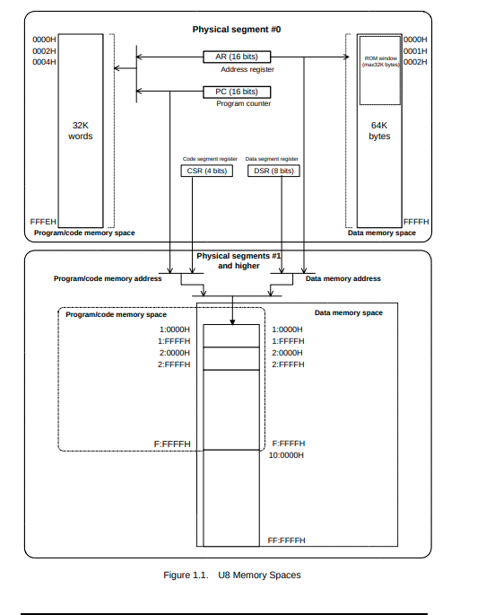
 Most modern computer architecture follow the Vonn Neumann Architecture. This means you have a single stick of RAM that contains both the code and data within it. But as mentioned earlier nx-u8 is harvard based architecture. This means it has seperate code and data space to work on.
When reading the manual i figured out that, there are two address spaces: 
- 512KB for code space 
- 16MB for data space. 

All the spaces are divided into physical segment of 64 kilobytes. 

#### Registers

Registers are the fastest piece of storage the CPU has access to. 
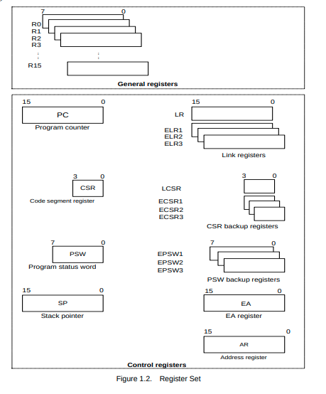

We care only about **Program Counter** and **Link Registers**.  

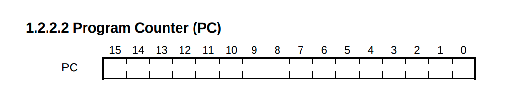
    **Program counter** holds the address for the next instruction to execute. 

-------

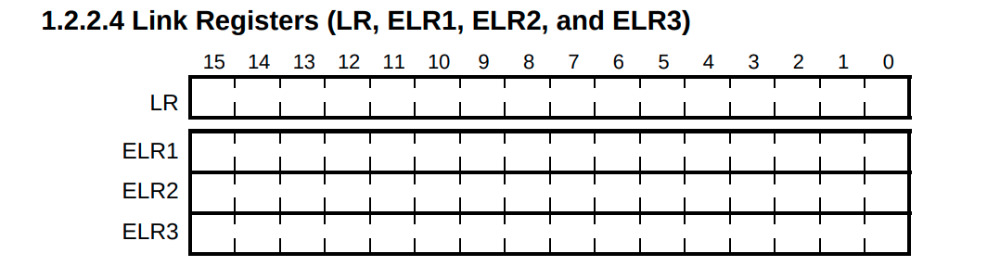
    **Link Registers** saves the contents of the program counter (PC) during subroutines/function calls and Interrupts. We only care about the first one called **LR** which is for Subroutine Call.

## Memory Model Revised
Let me reinformthat this is harvard architecture, you have different space for code and different space for memory.
- 512KB of codespace and the code space word length is 16bits. 
- 16MB of data space and the data memory word length is 8bits.  

Word length is the array of bits that a single address specify. 

----

The Memory map we are concerned with is data memory which contains ROM and RAM. According to [casio calc wikidot](https://casiocalc.wikidot.com/memory-map) the memory map is as follows

> The notation followed is `segment: hex_value` . Segment is basically collection of many addresses

- ### ROM : `0:0x0000h - 0:0x7FFFh`
    The address starting from 0x000h till 0x7FFFh is the ROM. For the purpose of the tutorial, we don't care about ROM 

- ### RAM : `0:0x8000h 0:0x8DFFh` 
    There are 3,583 addressable words. This means = `3583 x 8bits = 28664bits` of RAM is available to us. But more importantly RAM is again divided into sub segments. 

    - **Input Area**: `[0x8154 .. 0x81B8]` (total of 100 bytes) :  Input Area stores whatever you type in calculator, from numbers to formulaes. 

    - **Cache Area(Buffer Area)**: `[0x81B8 .. 0x821C]` (total of 100 bytes) : Cache Area stores the previous buffer if you press AC so that you can go backgward with `Replay Button`, the big circle one on center near the screen

# Let's start Hacking

Grab your Fx-991es calculator. Before we start hacking, let's define the `button convention` as there are lots of buttons.  

 
Anything within `[` `]` means you have to exactly press the button. Example
- `[CALC]`
- `[SHIFT]`
- `[logab]`

## Reaching the Null Terminator

- Start by entering LineIO mode - `[SHIFT] [MODE/SETUP] 2`
    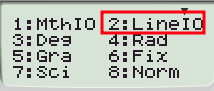
- Enter the following formula X = `[SHIFT] [logab] X , 1 , 10 ^ 9`
    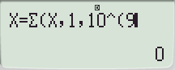
- Start the calculation by entering `[CALC]` and `=` and stop it with `[AC]`
    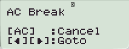 
- Press `[LEFT]` on a rounded button. Now replace the last parameter with 2 (`[DEL] [DEL] [DEL] 2`)
   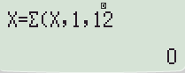 

- Start calculation with `[CALC]` =, you should get and error
    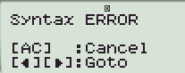
    
- now when you will press `[LEFT]` your cursor should be at the start of the expression, if you press anything you will see that nothing changes, that is because we reached the null terminator
    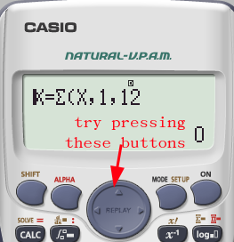

## Significance of Null terminator 

So, expression in the calculator is stored on the input buffer, once `[AC]` is pressed then the contents of `input buffer` is copied to `cache buffer`. 

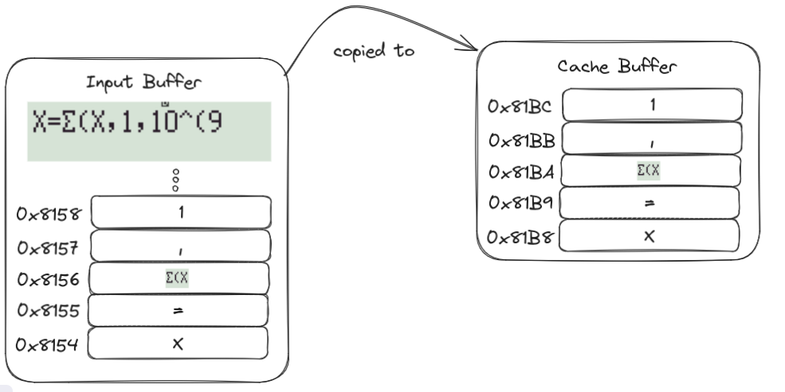

 The copying is done till `Null terminator`. If there is no `Null terminator` then the Calculator will keep on copying until the end of RAM. This is the big vulnerability.....
Normally it's not a problem because the calculator ensures that the input buffer is always null terminated, so it will not overflow... But what if we could overwrite the `Null` terminator ? 



The possibilities are endless....

> Remember that when `◄` is pressed then the contents of `cache buffer` is copied to `input buffer`. 

## Full flow
-  So we know how to reach the null terminator, what else we could ask for.  

## Stack

## What is Return Oriented Programming
**ROP(Return Oriented Programming)** btw is not related to the image above. 

### Big Spoiler

You can't directly program it.... well, all these architecture shenanigans were there because we are **ROPPING(Return Oriented Programming)** 

-----------
-----------

