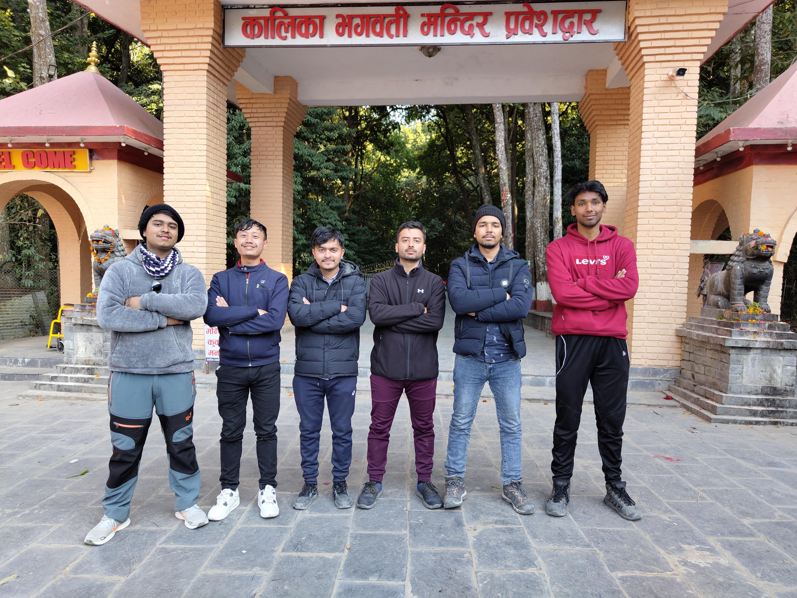

# Memories: Tour to Mustang

A written memoir of the trip from my side.



You are a child of universe

No less than the trees and the stars

you have the right to be here

And whether or not it is clear to you

no doubt the universe is unfolding as it should -- Max Ehrmann

## Cycling in pokhara:



all the eons before me and the time my life conjured

the back and forth between nihilism and fatalism

i accept the god within me

i accept the time that marks my beginning

i accept the time that marks my joys and pain

however i pass the dilemma of choice

for all the souls after me

## Fewataal boating:

The vortex in a swing

pushing forward; a gleamy dream

My life as a boat catching up with a mirage

## Roller skating:

i don’t know how many times i fell

as i tried roller skating

but i mustered up enough courage while bumbling

opened up those closed gates

Sandhya, you were the answer to my incessant but buried urges

## First time in Mustang:

The symphonies of black and white

gushing and pushing the essence;

quenching the thirst of

distant hills bleached in grey

## Baglung voices:

For it was the scale that left me bewildered

and then

the calmness of persistent stream below me as i walk through

the facade of hope, where every step is sensitive

maybe one day i will make it to the other side

and again desire to retrace those steps

just to complete the circle of life

For every bell that cries with the strike

i hope the agitation invokes the calmness within

after all, it is the belief that carries the soul

more than the chanting; so

no longer will i touch the intoxicant

for the blues in my heart

can only be tempered by you

## for my friends:

i thank the gods of serendipity

We were destined to meet

We are sharing a subtle and short path

as days goes by

i will remind myself to be forever grateful
