**MetaMask Snaps** is an experimental feature that extends MetaMask's functionality by allowing developers to create custom plugins (Snaps) that enhance the wallet's capabilities.
Snap feature is present in the canary build of MetaMask. The team releases canary build as a separate extension as [Metamask Flask](https://chromewebstore.google.com/detail/metamask-flask-developmen/ljfoeinjpaedjfecbmggjgodbgkmjkjk).

> New Metamask release v12.30.0 now has support for snap by default.
{.note}

From dev perspective, Snaps are small, sandboxed JavaScript programs that run inside MetaMask and can introduce new blockchain support, security enhancements, or UI modifications. This essentially allows adding wallet support for Bitcoin, Zcash etc even though they are non EVM

### Account Abstraction and ERC-4337

In Vitalik's blog [Some personal User experience](https://vitalik.eth.limo/general/2023/02/28/ux.html), he writes about losing small amount of BTC and ETH because he indirectly lost his secret key. A crypto ownership is having knowledge of private key. Once it's lost there is nothing one can do. There are some recovery methods and Vitalik used a wallet that supported [social recovery](https://vitalik.eth.limo/general/2021/01/11/recovery.html), it didn't work as expected. If it was his Google account then he would have multiple account recovery methods. Even for new users it would make sense if wallet ownership was as easy as logging into Google account but without any centralized aspect to it. It would immensely help the UX. Public and Private keys are still barrier to common usage. Also it would help if we had MFA, different ways of identification besides some secret key and multiple account recovery methods.

Smart contracts are computer programs. EVM allows smart contracts to hold funds and execute transactions. This means, One can define their own transaction logic.
**Account abstraction (AA)** allows *smart contract* to act as user accounts, enabling custom transaction validation and gas payment logic. This removes reliance on Externally Owned Accounts (EOAs) and improves UX by enabling features like sponsored transactions, multi-signature security, and batched operations

[ERC-4337](https://eips.ethereum.org/EIPS/eip-4337) is a specification that aims to use an [entry point contract](https://www.erc4337.io/understanding-ERC-4337/entry-point-contract.md) to achieve account abstraction without changing the consensus layer protocol of Ethereum.

#### Components for ERC-4337

There are several main components to ERC-4337: `UserOperation`, `Bundler`, `EntryPoint Contract`, `Account Contract`, `Account Factory Contract` and `Paymaster Contract`.

<figure>
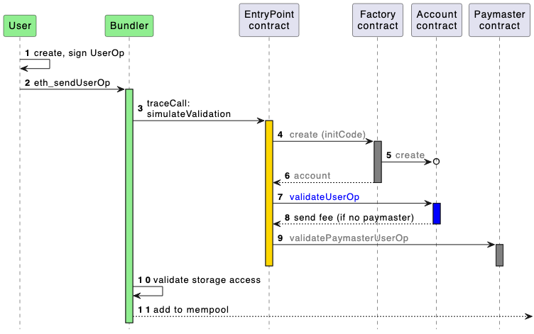
<figcaption aria-hidden="true">Flow.png</figcaption>
</figure>

- `UserOperations` are pseudo-transaction objects that are used to execute transactions with contract accounts. These are created by the Dapp. Wallets should be able to translate regular transactions into `UserOperations` so Dapps' frontends don't need to change anything to support ERC-4337
- `Bundlers` are actors that package UserOperations from a mempool and send them to the EntryPoint contract on the blockchain.
- `EntryPoint` is a smart contract that handles the verification and execution logic for transactions. Account Contracts are smart contract accounts owned by a user.
- `Account Contract` is the smart contract wallet of a user. Wallet developers are required to implement at least two custom functions - one to verify signatures, and another to process transactions.
- `Factory Contract` - When using a wallet for the first time, the `initCode` field of the `UserOperation` is used to specify creation of the smart contract wallet. This is used concurrently with the first actual operation of the wallet (in the same `UserOperation`). Creating new wallets should use the CREATE2 method to ensure the determinacy of generated addresses.
- `Paymaster Contracts` are optional smart contract accounts that can sponsor gas fees for Account Contracts, or allow their owners to pay for those fees with ERC-20 tokens instead of ETH.

## Metamask Snap

Snaps Execution Environment runs in isolated environment. For adding functionality to core wallet, permission has to be provided in `snaps.manifest.json`. For Custom RPC methods, `"endowment:rpc": { "dapps": true }`, has to be present in initialPermissions.

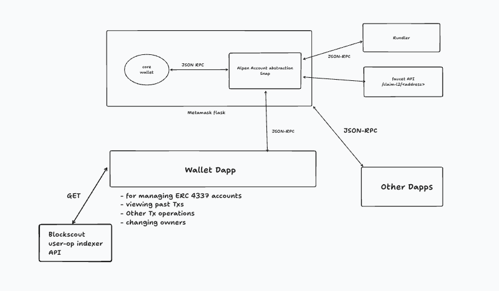
*figure: Architecture of AA-Snap*

#### Support for Custom Accounts

A **Keyring API Snap** is a plugin that extends MetaMask's wallet functionality by securely managing cryptographic keys beyond Ethereum's default key management.  You can use the Keyring API to display custom accounts and [ERC-4337 accounts](https://docs.metamask.io/snaps/features/custom-evm-accounts/#account-abstraction-erc-4337), alongside regular MetaMask accounts in the user interface:

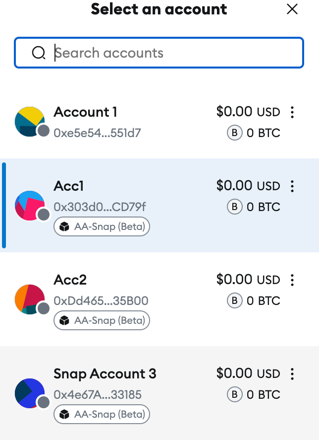
*figure:Account related to snap listed as AA-Snap(Beta)*

There are five components for a Snap based flow as shown in the figure below

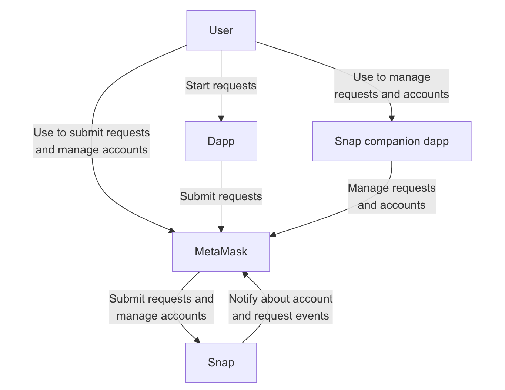
The diagram contains the following components:

- **User** - The user interacting with the dapp, the Snap companion dapp, and MetaMask.
- **Dapp** - The dapp requesting an action to be performed on an account.
- **MetaMask** - The wallet the dapp connects to. MetaMask routes requests to the account management Snap and lets the user perform some level of account management.
- **Snap** - The account management Snap that implements the Keyring API to manage the user's accounts and handle requests that use these accounts.
- **Snap companion dapp** - The Snap's user interface component that allows the user to interact with the Snap to manage accounts and requests.

| Snap Companion Dapp | Metamask Snap | Dapp |
|----|----|----|
| 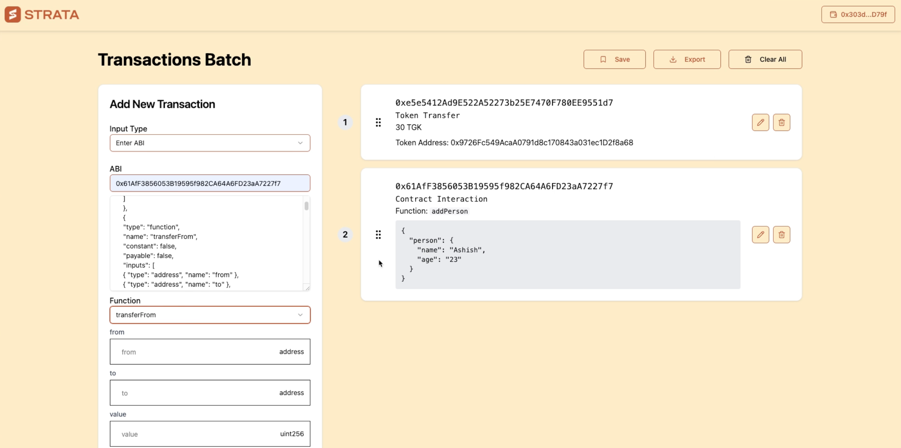 | 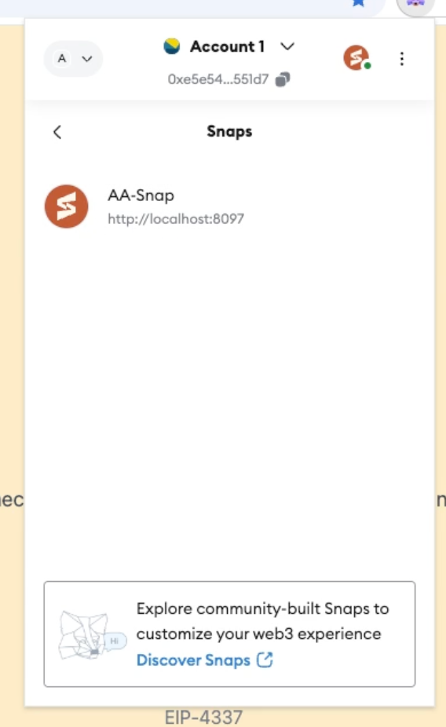 | 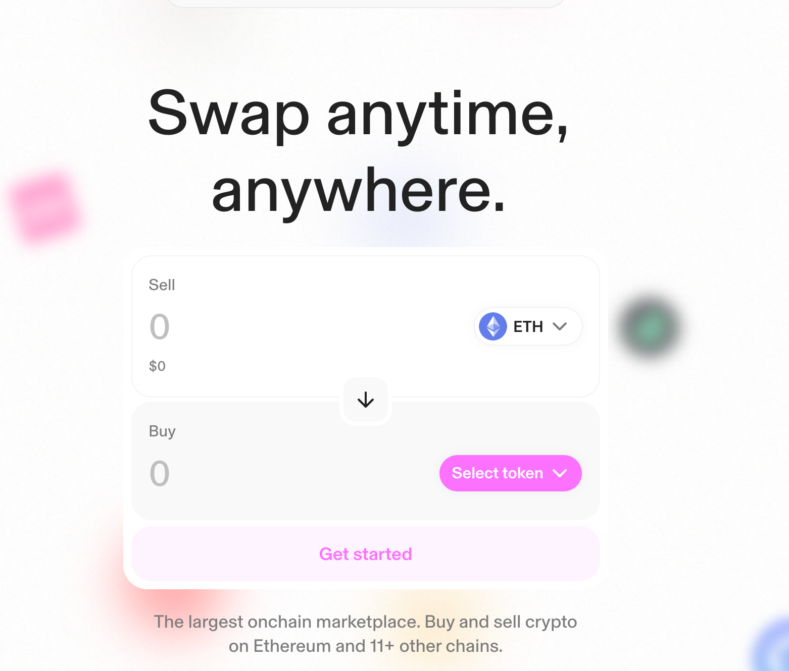 |

#### ERC-4337 Support

An account management Snap can implement the following methods to support dapp requests from ERC-4337 accounts:

- [`eth_prepareUserOperation`](https://docs.metamask.io/snaps/reference/keyring-api/chain-methods/#eth_prepareuseroperation)
- [`eth_patchUserOperation`](https://docs.metamask.io/snaps/reference/keyring-api/chain-methods/#eth_patchuseroperation)
- [`eth_signUserOperation`](https://docs.metamask.io/snaps/reference/keyring-api/chain-methods/#eth_signuseroperation)

The user operation signing flow in an ERC-4337 compatible account Snap looks like the following:

<figure>
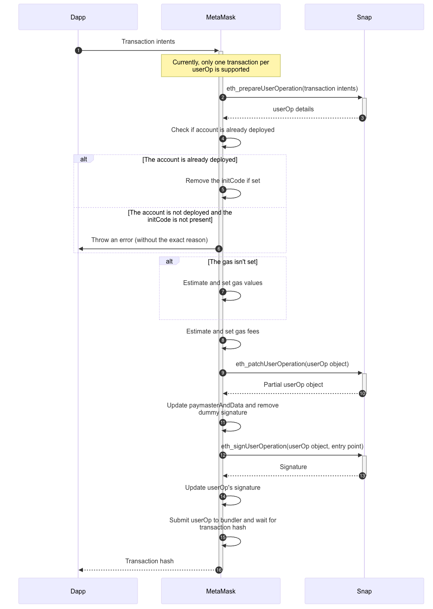
<figcaption aria-hidden="true">snap-flow.png</figcaption>
</figure>

### Implementation

#### Using Metamask snap documented method

##### Services

- Metamask snap version: 12.10.1-flask.0
- [Metamask-snap-keyring-api](https://github.com/MetaMask/snap-account-abstraction-keyring/releases/tag/v0.4.2)
- Network : [Anvil local (chain ID: 31337)](https://github.com/foundry-rs/foundry)
- Bundler used: <https://github.com/alchemyplatform/rundler> 
  - modified dev config to have chain ID: 31337

Entrypoint contract : v0.6.0 `0x5FF137D4b0FDCD49DcA30c7CF57E578a026d2789`
SimpleAccountFactory also hasn't been modified and is deployed as is

Rundler(bundler) is being run in unsafe mode to make sure transactions just goes

    RUST_LOG=info cargo run -- node --network dev \
      --node_http http://localhost:8545 --builder.private_keys 0x5de4111afa1a4b94908f83103eb1f1706367c2e68ca870fc3fb9a804cdab365a,0x5de4111afa1a4b94908f83103eb1f1706367c2e68ca870fc3fb9a804cdab365a --rpc.api eth,debug --unsafe --builder.max_bundle_size 1 --user_operation_event_block_distance 10000 --metrics.port 9000 --rpc.corsdomain "*"

This has been confirmed to work with custom written Account abstraction wallet [account-abstraction-demo](https://github.com/alpenlabs/aa-simpleaccount-demo/)

The team has  the following implementation <https://github.com/MetaMask/snap-account-abstraction-keyring> as a example. Several problems with the implementation
- encountered bug in their implementation [issue \#170](https://github.com/MetaMask/snap-account-abstraction-keyring/issues/170). i.e Creating Snap account due to new `scopes` field on `Keyring Account` is not possible
- This doesn't work with Dapps out of the box as described in the [issue \#73](https://github.com/MetaMask/snap-account-abstraction-keyring/issues/73) . We have to provide our internal methods, I have implemented `prepareAndSignUserOp` which prepares, signs and sends the userOp to bundler. But dapps have to change their code to fit our implementation. This is not desirable and not what wallet should make dapp developers do. The reason is described in point below
- The documentation was sparse about the support with dapps. When dapps calls `eth_sendTransaction`, `eth_prepareUserOp` method is called. But after that **there are no errors or warnings** and no further calls are made. As described in the docs, the core wallet calls the snap for `prepareuserOp` then core wallet checks if account is already deployed or not. It seems the logic of core wallet fails here. We can look at the logs of Snap by going to `Manage Extensions > Metamask flask > inspect Worker.html` but we can't look at logs of core wallet so there is no way to know where it failed.

##### Workaround : Create custom RPC request

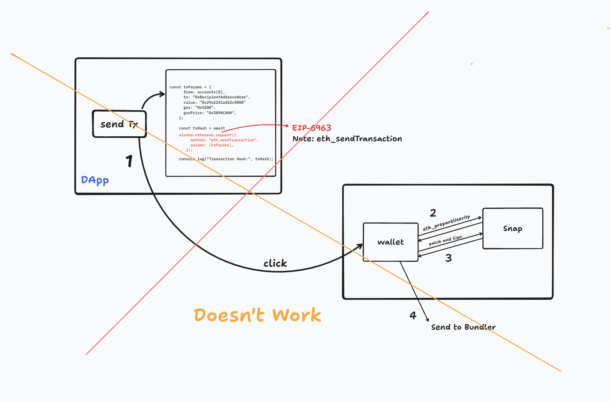
*figure: Standard flow doesn't work*

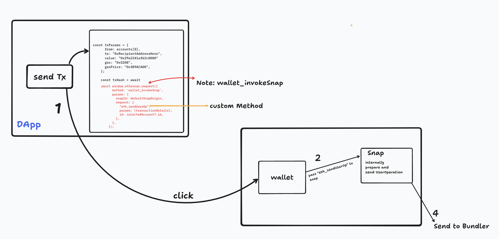
*figure: Workaround Flow*

If you look at the following piece of [code](https://github.com/alpenlabs/alpen-snap/blob/44e73a9c00cf385f4dfa23e10cb349b8b60dbf4a/aa-snap/packages/snap/src/index.ts#L47), then you will see that custom RPC method has been created . The workaround introduces custom RPC method (`SendUserOperation`) in the Strata Snap. These methods forward userOp requests to the snap through different route, so the `eth_prepareUserOp` is never called. This ensures that user operations can still be submitted, even though the standard flow is broken. But this is a dealbreaker.

#### Treat the snap like it's EOA

This implementation method opts for using `EthAccountType.EOA` instead of `EthAccountType.4337` .

An account management Snap can implement the following methods to support dapp requests from externally owned accounts (EOAs):

- [`personal_sign`](https://docs.metamask.io/snaps/reference/keyring-api/chain-methods/#personal_sign)
- [`eth_signTypedData_v4`](https://docs.metamask.io/snaps/reference/keyring-api/chain-methods/#eth_signtypeddata_v4)
- [`eth_signTransaction`](https://docs.metamask.io/snaps/reference/keyring-api/chain-methods/#eth_signtransaction)

MetaMask provides with hook [`submitRequest(req)`](https://github.com/alpenlabs/aa-snap/blob/9bc261b9bdfa237f279277e4b752db9104d25c1c/packages/snap/src/keyring.ts#L213). We can use that for EOA methods  `personalSign` , `signTransaction` and `signTypeddataV4`. The trick is **When we are signing transaction we also build the userOp and send to bundler. This allows for seamless interaction with Dapp with one down side**. Even though transaction is **successful** the core wallet will always assume the transaction failed. If we rely on `Snap_dialog` then we can show correct Tx details. But the invocation of `await window.ethereum.request("eth_sendTransaction",...)` will always fail

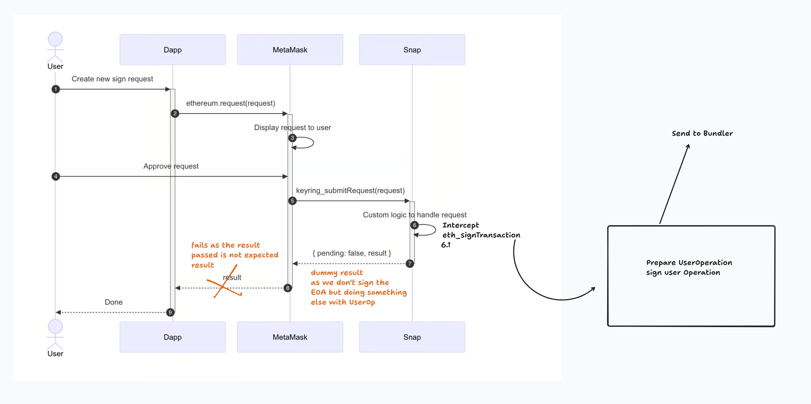
*figure: EOA Hack*
